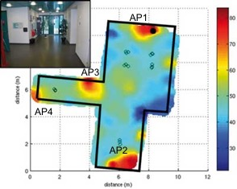

# Mobile Data Analysis
Projects for mobile sensor data collection, pre-processing and analysis

## WiFi triangulation 

- Setup Python development environment
- Install Python package
- Determine the location of a mobile device from RSSI readings and locations of APs given a certain path loss model
- Evaluate the impact of averaging in RSSI
- Visualize the input and output data

## Step counting using IMU data

- Pose estimation from IMU data collected by stationary mobile device
- Step counting by using peak detection on Accelemeter data

## Particle Filter for Indoor Positioning using IMU Measurements

- Implement Particle Filter (PF) framework
- Read the OSM format map data
- Using head estimation, step counting based on gyro, accelemeter data

## Gaussian Process Regression for WiFi Fingerprinting-based Localization

GP Regression:
- Parition the data into training and testing sets randomly (e.g., % of the locations and their RSS readings are in the training set and the remaining 10% in the testing set).  
- Train a GP for **each** feature (AP) using RBF kernel (maximally, there are num_AP GP's).  
- Optimize the hyper-parameters via optimization *model.optimize*

